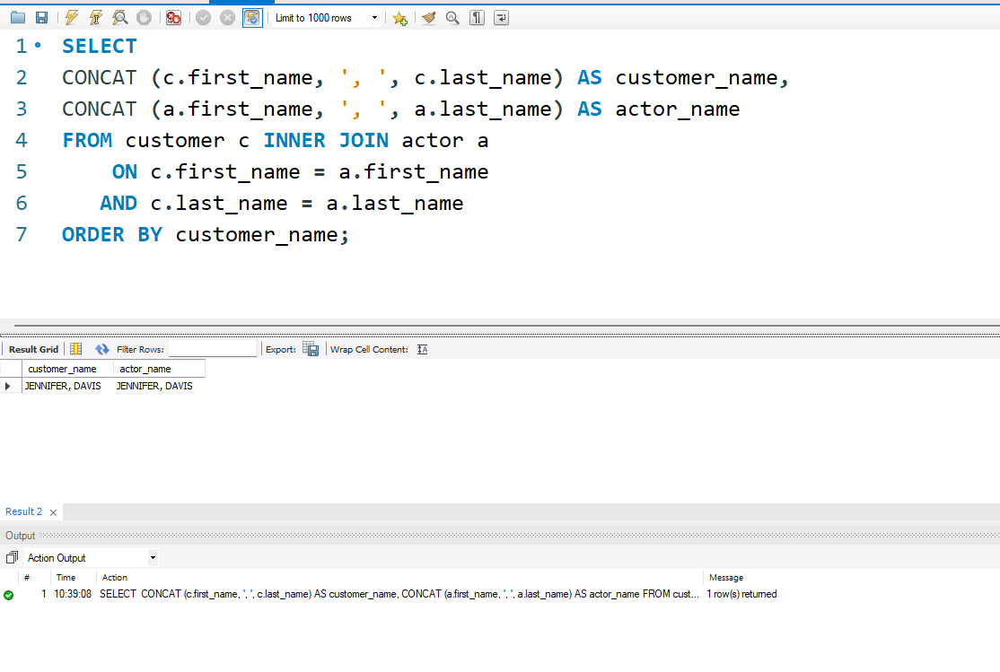

# MySQL_Chapter3_SingleTableQueries
<b>Table of Content</b>
- [Summary](#summary)
- [Collaborators](#collaborators)
- [New Concepts Used](#list-of-new-concepts-used)
- [Console Output Example](#console-output-testing-as-images)

## Summary

## Collaborators

**Khumo Nakedi** 

Github: [@nakediKhum03](https://github.com/nakediKhum03) 

## New Concepts Used

## console output testing as images
### Query 1

